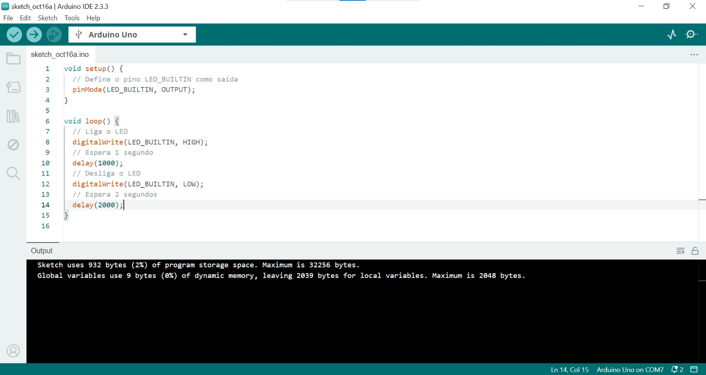

# Projeto1-arduino

Código e demonstração do LED INTERNO piscando.

[Link para o vídeo do funcionamento](https://drive.google.com/file/d/1ArcGcFT8_9kAhcSUodhAXLRvSoVVVQEI/view?usp=drivesdk)

<div align="center" width="100%">
<sub>Figura 1 - Arduino IDE.</sub>

<sup>Fonte: Material produzido pelos autores (2024).</sup>
</div>

Código do TinkerCad

```C
void setup()
{
  pinMode(LED_BUILTIN, OUTPUT);
}

void loop()
{
  digitalWrite(LED_BUILTIN, HIGH);
  delay(1000); // Wait for 1000 millisecond(s)
  digitalWrite(LED_BUILTIN, LOW);
  delay(1000); // Wait for 1000 millisecond(s)
}
```
[Link do tinkercad](https://www.tinkercad.com/things/6jH8jnhTsRR-funky-albar/editel?returnTo=https%3A%2F%2Fwww.tinkercad.com%2Fdashboard)
[Link para o vídeo do funcionamento no aruduino real](https://drive.google.com/file/d/1AzmnyvZbTj2ZjV3CatkQMDgVskBKhvLZ/view?usp=drivesdk)